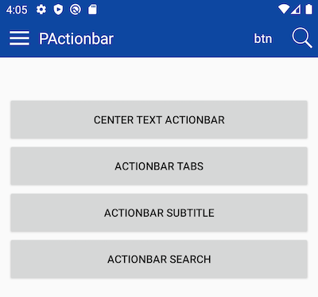
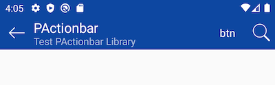

# PActionbar
Custom Android Actionbar with a lot of capabilities like Tabs , subtitle , menubutton , backbutton , text and icon buttons , ...




## install
### Main build.gradle
```
buildscript {
    
    repositories {
        jcenter()
    }
}
```
### App build.gradle
```
implementation 'com.dpouya:PActionbar:1.0.0'
```

### Normal Actionbar

```java
 pActionbar=new PActionbar(this);
 pActionbar.setTitle("PActionbar");
 pActionbar.setBackgroundColor(0xff0d47a1);
 frameLayout.addView(pActionbar);
```


### Drawer icon

```java
pActionbar.showDrawerMenuicon(true);
pActionbar.setOnIconClick(v -> Toast.makeText(MainActivity.this,"Menu Button",Toast.LENGTH_SHORT).show());
```
### Back Button
```java
pActionbar.showBackButton(true);
pActionbar.setOnIconClick(v -> finish());
```

## Add Icon Button
```java
pActionbar.addButton(
    new PActionbarButton(null, mydrawable, v -> Toast.makeText(MainActivity.this,"Toast1 Button",Toast.LENGTH_SHORT).show())
    );
```

## Add Text Button
```java
pActionbar.addButton(
    new PActionbarButton("btn", null, v -> Toast.makeText(MainActivity.this,"Toast1 Button",Toast.LENGTH_SHORT).show())
    );
```

## Center Text

```java
pActionbar.setCenteredText("CenterTitle", Typeface.DEFAULT_BOLD,20);
```

## Tabs


### Tabs Custom event
```java
ArrayList<String> tabs = new ArrayList<>();
        tabs.add("Home");
        tabs.add("Search");
        tabs.add("Info");
        pActionbar.setupTabs(tabs, new TabLayout.OnTabSelectedListener() {
            @Override
            public void onTabSelected(TabLayout.Tab tab) {
                Toast.makeText(TabActionbarActivity.this,tab.getText(),Toast.LENGTH_SHORT).show();
            }

            @Override
            public void onTabUnselected(TabLayout.Tab tab) {

            }

            @Override
            public void onTabReselected(TabLayout.Tab tab) {

            }
        });
```

### Tabs with ViewPager
```java
pActionbar.setupTabs(null,ourTabViewPager);
```

## Actionbar SubTitle

```java
pActionbar.setSubTitle("Test PActionbar Library");
```

## Actionbar Search

```java
pActionbar.setSearchmode(true);
pActionbar.setSearchhint("Search For Anything...");
pActionbar.getSearchIcon().setOnClickListener(new View.OnClickListener() {
    @Override
    public void onClick(View v) {
        Toast.makeText(v.getContext(),"Searching: " + pActionbar.getTxtSearch().getText().toString(),Toast.LENGTH_SHORT).show();
    }
});
```
